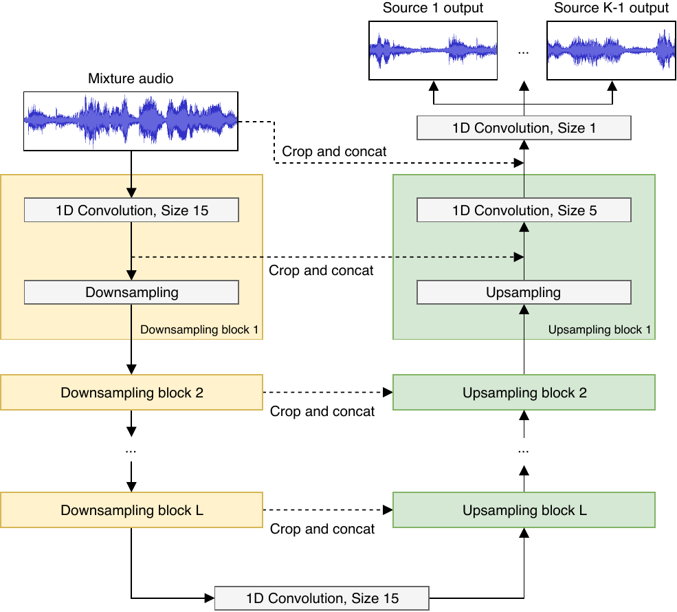
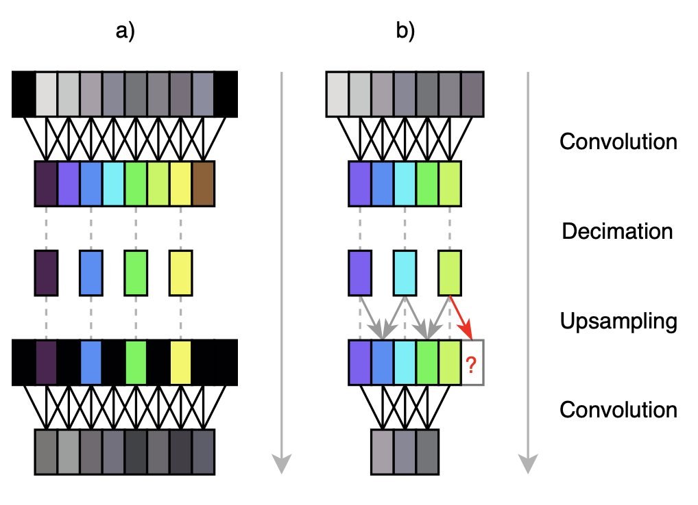
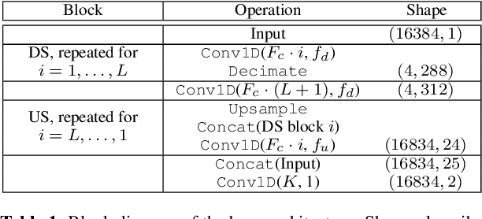

# Audio-Source-Separation
## Wave-U-Net Model
<h2>Audio Source Separation project based on Wave-U-Net </h2>
<h3>Paper Source : https://arxiv.org/abs/1806.03185</h3>

The Model Consists of 1D Convolutional layers with U-Net Architechture

  

The Encoder Layers are downsampled by decimation which is a general method to reduce
the sampling rate of an audio data

  

The Decoder Layers are upsampled by simple linear interpolation with sigmoid activation function for smoothing 
  

Take a look of the model's architechture in the paper :

 
I had to apply several modifications for the model in order to tackle run out of memory problem.

### Limitations
The model's performance is not as good as the other extra large Audio Source Separation models like OpenUnMix and HDEMUCS. Despite of that, this model is very feasible to run locally on mobile application after applying some optimization for mobile apps like Quantization and Pruning considering the relatively small size of the model (compared to other models).

## MUSDB Dataset
The MUSDB Dataset provides a collection of multitrack music recordings specifically designed for source separation research. It consists of a diverse musical genre and provides supervised ground truth annotations for each track which is delivered in isolated sources (vocals, drums, bass, accompaniment, and others)

  
This Dataset is quite well-known among the researchers and practicioners in the field of Audio Signal Processing and Source Separation.